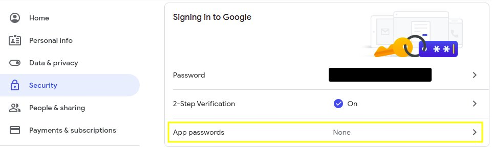
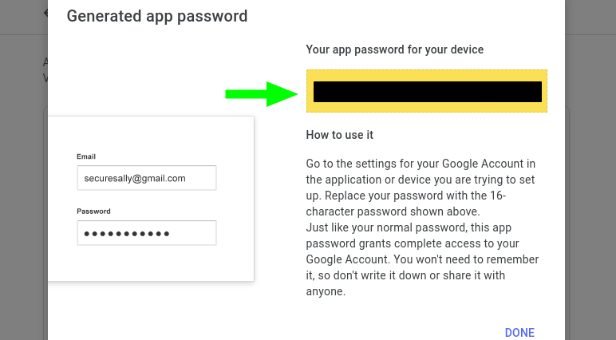
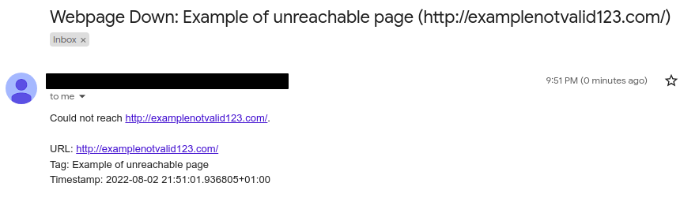
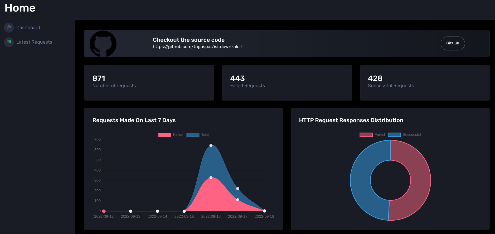
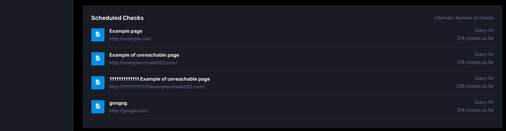
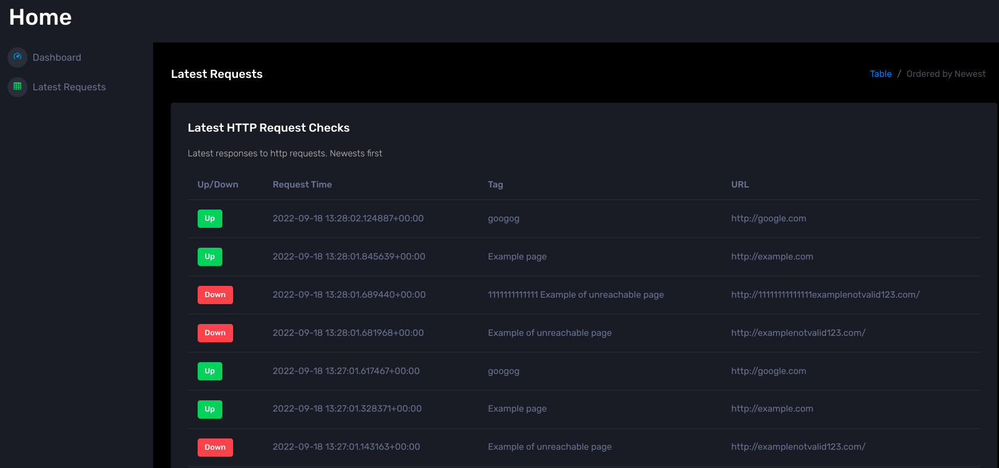

# Is It Down Alert - Webpage Status Email Alerts

Validates if webpages are online on a predefined interval. Sends email alerts from gmail account if a page is down. Validation results are stored in a `PostgresDB` and displayed on a Dashboard build with `Flask`, `Jinja` and `Chart.js`. Quick and simple deployment using Docker containers.

Live example of Dashboard [here](http://isitdown.tgaspar.com/).

## Table of Contents
- [Is It Down Alert - Webpage Status Email Alerts](#is-it-down-alert---webpage-status-email-alerts)
  - [Table of Contents](#table-of-contents)
  - [Features](#features)
  - [Requirements](#requirements)
  - [Installation and Setup](#installation-and-setup)
    - [Setting up a Gmail account to use as Sender](#setting-up-a-gmail-account-to-use-as-sender)
    - [Setting up the project](#setting-up-the-project)
    - [Removing Docker container](#removing-docker-container)
  - [Email Alert Example](#email-alert-example)
  - [PostgreSQL Database](#postgresql-database)
  - [Dashboard Webapp](#dashboard-webapp)
    - [Dashboard](#dashboard)
    - [Latest Request](#latest-request)
  - [Dependencies](#dependencies)
## Features

* Sends request to website periodically;
* Current time intervals allowed:
  * every x minutes;
  * every x hours;
  * every x days;
* Abstracts crontab job creation.
* User chooses which websites to check as well as the interval for each one by populating *webpages.yaml*
* If an http request does not return an expected response status code, an email is sent to a specified email address.
* Validation results stored in Postgres database.
* Dashboard website queries database and provides stats and charts to make information available to users.
* Dockerized allowing easy and fast deployment on any system running docker.

## Requirements

* <a href="https://docs.docker.com/get-docker/">Docker</a>
* <a href="https://docs.docker.com/compose/install/">Docker Compose</a>

## Installation and Setup

### Setting up a Gmail account to use as Sender

**Important:** Due to security reasons, create a new Gmail account to use as sender. Avoid using this account for other purposes.

After creating a Gmail account, an App Password needs to be created. 

1. 2-Step Verification must be enabled on *Google account settings > Security*

2. Create an **App Password**:

<p align="center">

</p>

On *Select app* chose *Other (Custom name)* and chose any name.
Save the password for later use in project parameters.

<p align="center">

</p>

### Setting up the project

1. Clone the repository:

```bash
$ git clone https://github.com/tngaspar/isitdown-alert.git
```

2. Create `.env` file in project root folder with the following parameters:
```
SENDER_EMAIL=<Sender Gmail created = example@gmail.com>
APP_PASSWORD=<App Password created for Gmail Account>
RECEIVER_EMAIL=<Email that Receives Alerts = example@something.com>
TIME_ZONE=<Timezone for Email Timestamps. Example: Europe/Amsterdam>

HOST=db
POSTGRESUSER=<username to access postgres db>
POSTGRESPASSWORD=<password to access postgres db>
DATABASE=<database name>
```
Find a list of availbable timezones [here](https://pypi.org/project/pytz/).

3. Edit `webpages.yaml` and add all the webpages to check as well as the corresponding time intervals. This file already contains 2 examples and instruction on how to configure it.

4. Build and run the container:

```bash
$ docker-compose build  # Builds the container
$ docker-compose up -d  # Runs the container
```
Check if the container is running with the command `docker ps`.

That's it. The email alerts should now be activated. 

Before deploying final webpage list, I would recommend using an unreacheble URL with a small interval to check if emails are being sent. 

In a future release, I intend to add a way to track sucessfull requests to verify that all is up and running and keep an history of websites' downtimes.

### Removing Docker container

```bash
$ docker-compose stop  # Stops the container
$ docker-compose rm  # Removes the container
```

## Email Alert Example

Emails sent when website is unreacheble have the following format:

<p align="center">

</p>

## PostgreSQL Database

Currently the database named **cron** has the following tables:

`cron.dim_webpages`:
| Column   | Type                                                    |
|----------|---------------------------------------------------------|
| id       | integer Auto Increment [nextval('dim_webpages_id_seq')] |
| tag      | character varying(2000) NULL                            |
| url      | character varying(2000) NULL                            |
| interval | character varying(255) NULL                             |

Stores webpages for which cronjobs were created and are currently active. This table mirrors the user input data from *webpages.yaml*.

`cron.history`:
|    Column    | Type                                               |
|:------------:|----------------------------------------------------|
| id           | integer Auto Increment [nextval('history_id_seq')] |
| request_time | timestamptz                                        |
| tag          | character varying(2000) NULL                       |
| url          | character varying(2000)                            |
| is_up        | boolean                                            |
| status_code  | integer NULL                                       |
| response_url | character varying(2000) NULL                       |

Stores results from validations over time. Creates new record each time a a cron job runs and a http request is made.

## Dashboard Webapp

Dashboard that displays data from PostgreSQL database in an accessible format. 

[Flask](https://github.com/pallets/flask) used for routing. [Jinja Corona Dark](https://github.com/app-generator/jinja-corona-dark) template used as base template for UI components. [Chart.js](https://github.com/chartjs/Chart.js) used for dashboarding.

The webapp at the moment contains two pages:

### Dashboard

High level stats, last 7 day chart and all request chart.

<p align="center">

</p>

Currently active validations, time between requests and amount of requests previously made.

<p align="center">

</p>

### Latest Request

Table of latest request results. Shows the most recent 100 request ordered from newest to oldest.

<p align="center">

</p>

## Dependencies

* [Yagmail](https://pypi.org/project/yagmail/)
* [python-crontab](https://pypi.org/project/python-crontab/)
* [PyYAML](https://pypi.org/project/PyYAML/)
* [pytz](https://pypi.org/project/pytz/)
* [python-dotenv](https://pypi.org/project/python-dotenv/)
* [psycopg2-binary](https://github.com/psycopg/psycopg2)
* [Flask](https://github.com/pallets/flask)
* [gunicorn](https://github.com/benoitc/gunicorn)

These dependencies may be found in the *requirements.txt* file and are installed while building docker containers. 

For local development and debugging this dependencies are installed using:

```bash
$ pip install -r requirements.txt
```

During development I installed these in a virtualenv. More on python virtual enviroments [here](https://docs.python.org/3/library/venv.html).

<p align="right">(<a href="#top">back to top</a>)</p>